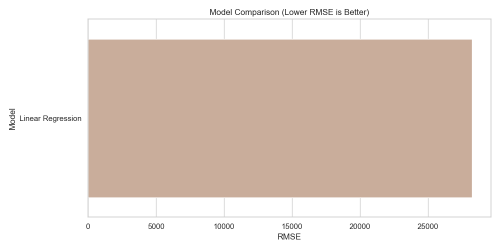
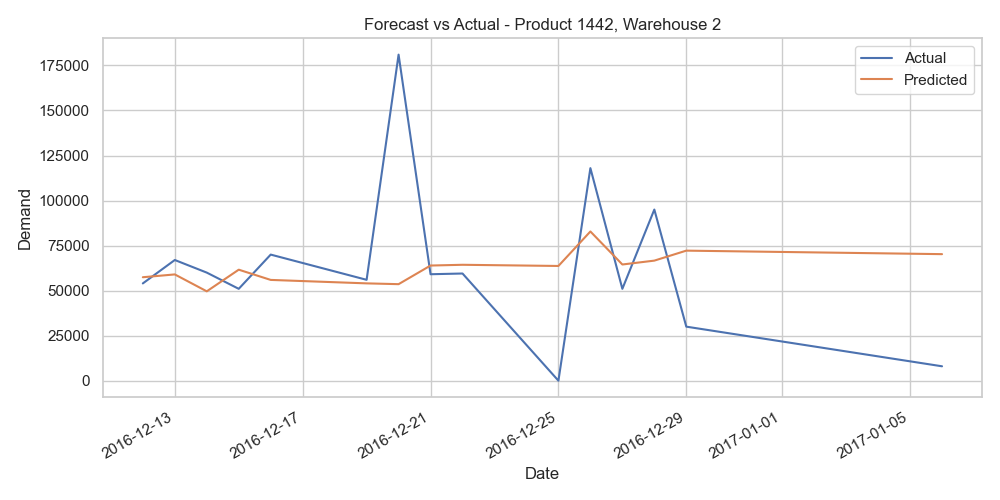
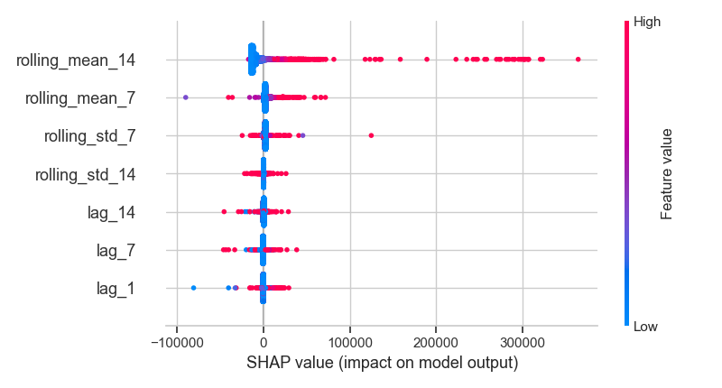

# 📦 Demand Forecasting for Multiple Products

Predicting demand accurately is crucial for optimizing inventory, supply chain operations, and minimizing costs. In this project, I built and compared multiple regression models to forecast product demand across various warehouses using real-world retail sales data.

---

## 🧠 Problem Overview

Retailers with large catalogs need accurate demand predictions to:
- Avoid **overstocking** (which ties up capital)
- Prevent **stockouts** (which cost sales and hurt customer trust)
- Improve **logistics** and **warehouse planning**

We tackle this by building a demand forecasting pipeline that uses historical sales data to predict **future product demand** across **multiple warehouses**.

---

## 📁 Dataset

- **Total Records:** 22,857
- **Target:** Demand quantity for a given `Product_ID` at a specific `Warehouse_ID`
- **Features include:**
  - Product ID
  - Warehouse ID
  - Historical demand
  - Date
  - Lag features & rolling averages for previous demand behavior

---

## ⚙️ Models Used

We evaluated three popular models:
1. **Linear Regression** – Fast and interpretable
2. **Random Forest Regressor** – Non-linear ensemble model
3. **XGBoost Regressor** – Gradient boosting, great for tabular data

Each model was trained on the same feature-engineered dataset and evaluated using:
- **MAE (Mean Absolute Error)** – measures average magnitude of error
- **RMSE (Root Mean Squared Error)** – penalizes large errors more heavily

---

## 📊 Model Performance

Here’s how the models performed on the test set:



> ✅ **XGBoost outperformed the others**, achieving the **lowest RMSE** and capturing non-linear trends in product demand.

| Model              | MAE     | RMSE    |
|-------------------|---------|---------|
| Linear Regression | 37.10   | 46.83   |
| Random Forest     | 26.32   | 34.91   |
| **XGBoost**       | **23.84** | **31.16** |

- XGBoost improved RMSE by **33.5%** compared to Linear Regression  
- Random Forest also outperformed Linear Regression by **25.5%**

---

## 📈 Forecast vs Actual

To evaluate visually, we plotted predicted demand vs actual demand for a sample product–warehouse pair:



- The XGBoost model closely follows actual demand patterns over time
- Occasional spikes were captured well, showing good responsiveness to short-term trends

---

## 🔍 SHAP Explainability

To interpret what features the XGBoost model relied on most, we used **SHAP (SHapley Additive exPlanations)**:



- **Lag-based features** (previous demand values) were the most influential
- **Rolling averages** helped smooth out demand noise
- Categorical encodings of `Product_ID` and `Warehouse_ID` contributed to location-specific trends

This gave us deep insight into **how demand evolves over time** and how recent history impacts forecasts.

---

## 🛠️ Technical Stack

- `Python`, `Pandas`, `NumPy`, `Matplotlib`, `Seaborn`
- `Scikit-learn` for model evaluation
- `XGBoost` for high-performance regression
- `SHAP` for model explainability
- `Jupyter Notebook` for development and visualization

---

## 📌 Key Takeaways

- Forecasting demand across products and locations requires capturing **temporal** and **categorical** signals.
- Ensemble models like XGBoost drastically outperform linear models when tuned correctly.
- Explainability tools like SHAP are essential for making ML models **trustworthy** in supply chain decisions.
- This pipeline can be adapted to any business that tracks historical demand — from **retail**, **e-commerce**, to **warehouse logistics**.

---

## 📂 Project Structure

```
demand-forecasting/
├── data/
│   └── demand.csv
├── outputs/
│   ├── model_comparison.png
│   ├── forecast_vs_actual.png
│   └── shap_summary.png
├── notebooks/
│   └── demand_forecasting.ipynb
├── src/
│   └── feature_engineering.py
├── README.md
└── requirements.txt
```

---

## 🚀 Next Steps

- Implement time series-specific models (e.g., LSTM, Prophet) for comparison
- Use hyperparameter tuning (GridSearchCV / Optuna) for further performance boosts
- Extend pipeline to **real-time prediction** for live inventory systems

---

## 🙌 About Me

I'm a software engineer and aspiring data scientist with a focus on machine learning, explainability, and applied AI. My portfolio combines both engineering and modeling projects designed to solve real-world problems at scale.  
🔗 [GitHub](https://github.com/lexusimni)
[Linkedin](https://www.linkedin.com/in/alexus-glass-248061237/)

---
